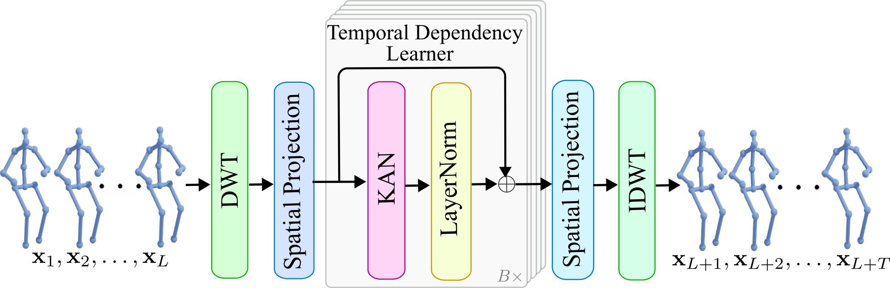

# LuKAN
**A Kolmogorov-Arnold Network Framework for 3D Human Motion Prediction**

This repository contains the code for our project on 3d human motion prediction.

### Architecture



### Predictive Performance of LuKAN on Human3.6M Dataset

| Method            | 80   | 160  | 320  | 400  | 560  | 720  | 880  | 1000 |
|-------------------|------|------|------|------|------|------|------|------|
| ConvSeq2Seq [15]  | 16.6 | 33.3 | 61.4 | 72.7 | 90.7 | 104.7| 116.7| 124.2|
| LTD-10-10 [21]    | 11.2 | 23.4 | 47.9 | 58.9 | 78.3 | 93.3 |106.0 |114.0 |
| Hisrep [22]       | 10.4 | 22.6 | 47.1 | 58.3 | 77.3 | 91.8 |104.1 |112.1 |
| DMGNN [16]        | 17.0 | 33.6 | 65.9 | 79.7 |103.0 |   -  |  -   |137.2 |
| MSR-GCN [6]       | 11.3 | 24.3 | 50.8 | 61.9 | 80.0 |   -  |  -   |112.9 |
| ST-DGCN [19]      | 10.6 | 23.1 | 47.1 | 57.9 | 76.3 | 90.7 |102.4 |109.7 |
| SPGSN [17]        | 10.4 | 22.3 | 47.0 | 58.2 | 77.4 |  -   |  -   |109.6 |
| CIST-GCN [24]     | 10.5 | 23.2 | 47.9 | 59.0 | 77.2 |  -   |  -   |110.3 |
| MotionMixer [3]   | 11.0 | 23.6 | 47.8 | 59.3 | 77.8 | 91.4 |106.0 |111.0 |
| SiMLPe [11]       |_9.6_ |_21.7_|_46.3_|_57.3_|_75.7_|_90.1_|_101.8|_109.4_|
| **LuKAN (ours)**  |**9.4**|**21.5**|**46.2**|**57.2**|**75.7**|**89.9**|**101.6**|**109.3**|


### Requirements
------
- matplotlib==3.9.1
- numpy==1.26.4
- scikit_learn==1.5.1
- setuptools==69.5.1
- sympy==1.12.1
- torch==1.13.0
- tqdm==4.66.4
- pandas==2.2.2
- seaborn
- pyyaml==6.0.1
- PyWavelets==1.6.0
- einops==0.8.0
- scipy==1.13.0
- six==1.16.0
- Easydict==1.13


### Datasets
------
All of our datasets were taken from their official websites.

- [H3.6M](http://vision.imar.ro/human3.6m/description.php)

- [AMASS](https://amass.is.tue.mpg.de/)

- [3DPW](https://virtualhumans.mpi-inf.mpg.de/3DPW/)

### Commands
------
#### H3.6M
##### Training
```bash
cd h36m
CUBLAS_WORKSPACE_CONFIG=:4096:8 python train.py
```
##### Evaluation
```bash
python test.py --model-pth your/model/path
```

#### AMASS AND 3DPW
##### Training
```bash
cd amass_and_3dpw
CUBLAS_WORKSPACE_CONFIG=:4096:8 python train.py
```
##### Evaluation
```bash
#Test on AMASS
python test.py --model-pth your/model/path 
#Test on 3DPW
python test_3dpw.py --model-pth your/model/path 
```

## 📖 Citation

If you use this work, please cite:

```bibtex
@inproceedings{zadid2025lukan,
  title={LuKAN: A Kolmogorov-Arnold Network Framework for 3D Human Motion Prediction},
  author={Hasan, Md Zahidul and Ben Hamza, Abdessamad and Bouguila, Nizar},
  booktitle={Proceedings of the British Machine Vision Conference (BMVC)},
  year={2025}
}

